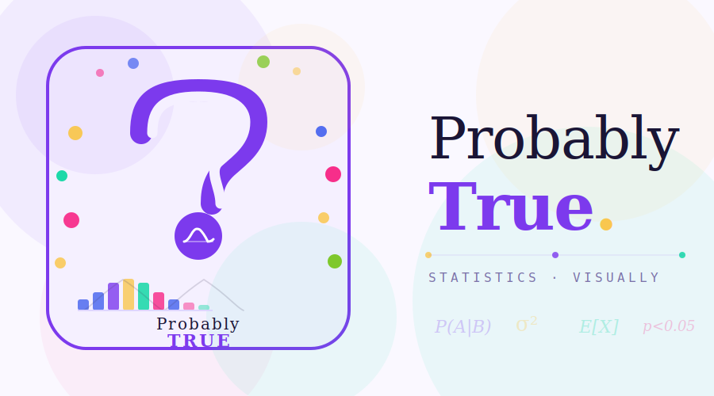

# Probably True 🎲

> **Statistics, Visually** — Interactive visual explanations of statistics, machine learning, and AI for everyone.



## 🌐 Live Site
[probablytrue.vercel.app](https://probablytrue.vercel.app) *(after you deploy)*

## 📖 About
Probably True makes statistics accessible through interactive D3.js visualizations. Inspired by [Seeing Theory](https://seeing-theory.brown.edu/), but with our own unique style — colorful, playful, and built for students, professionals, and curious minds of all ages.

## 🗂️ Project Structure
```
probably-true/
├── index.html                    ← Homepage
├── css/
│   └── style.css                 ← Global styles (colors, fonts, layout)
├── js/
│   └── main.js                   ← Shared JS (scroll reveals, utils)
├── chapters/
│   ├── probability/
│   │   ├── index.html            ← Chapter 1: Probability
│   │   └── probability.js        ← D3 visuals for probability
│   ├── distributions/
│   │   ├── index.html            ← Chapter 2: Distributions
│   │   └── distributions.js
│   ├── inference/
│   │   ├── index.html            ← Chapter 3: Inference
│   │   └── inference.js
│   ├── regression/
│   │   ├── index.html            ← Chapter 4: Regression
│   │   └── regression.js
│   └── ml/
│       ├── index.html            ← Chapter 5: Machine Learning
│       └── ml.js
└── assets/
    └── images/
        └── preview.png           ← Social preview image
```

## 🛠️ Tech Stack
| Tool | Purpose |
|------|---------|
| HTML5 | Page structure |
| CSS3 | Styling, animations |
| JavaScript (ES6) | Interactivity, physics |
| [D3.js v7](https://d3js.org/) | Data visualizations |
| [Google Fonts](https://fonts.google.com/) | Nunito + DM Mono fonts |
| GitHub Pages / Vercel | Free hosting |

## 🚀 Getting Started

### 1. Clone the repo
```bash
git clone https://github.com/YOUR_USERNAME/probably-true.git
cd probably-true
```

### 2. Open locally
```bash
# Option A — just open in browser
open index.html

# Option B — use VS Code Live Server (recommended)
# Install "Live Server" extension in VS Code
# Right-click index.html → "Open with Live Server"
```

### 3. Make changes
- Edit text → open any `.html` file
- Change colors → edit `css/style.css` (look for `:root` variables)
- Modify animations → edit the relevant `.js` file

### 4. Deploy to Vercel (free)
```bash
# Push to GitHub first
git add .
git commit -m "your message"
git push

# Then go to vercel.com
# → New Project → Import from GitHub → Select probably-true → Deploy
# Your site is live in 60 seconds!
```

## 🎨 Brand Colors
| Name | Hex | Used For |
|------|-----|---------|
| Purple | `#7c3aed` | Primary, logo, headings |
| Yellow | `#f9c74f` | Accents, highlights |
| Teal | `#06d6a0` | Secondary CTA |
| Pink | `#f72585` | Chapter 4, accents |
| Blue | `#4361ee` | Chapter 3, links |
| Lime | `#74c417` | Chapter 5 |

## 📚 Chapters Roadmap
- [x] Homepage with physics simulation
- [ ] Chapter 1: Probability *(in progress)*
- [ ] Chapter 2: Distributions
- [ ] Chapter 3: Inference
- [ ] Chapter 4: Regression
- [ ] Chapter 5: Machine Learning
- [ ] Chapter 6: Deep Learning
- [ ] Chapter 7: LLMs

## 🤝 Contributing
This is an open educational project. PRs welcome!

## 📄 License
MIT License — free to use and learn from.

---
Made with curiosity & D3.js 🎲
